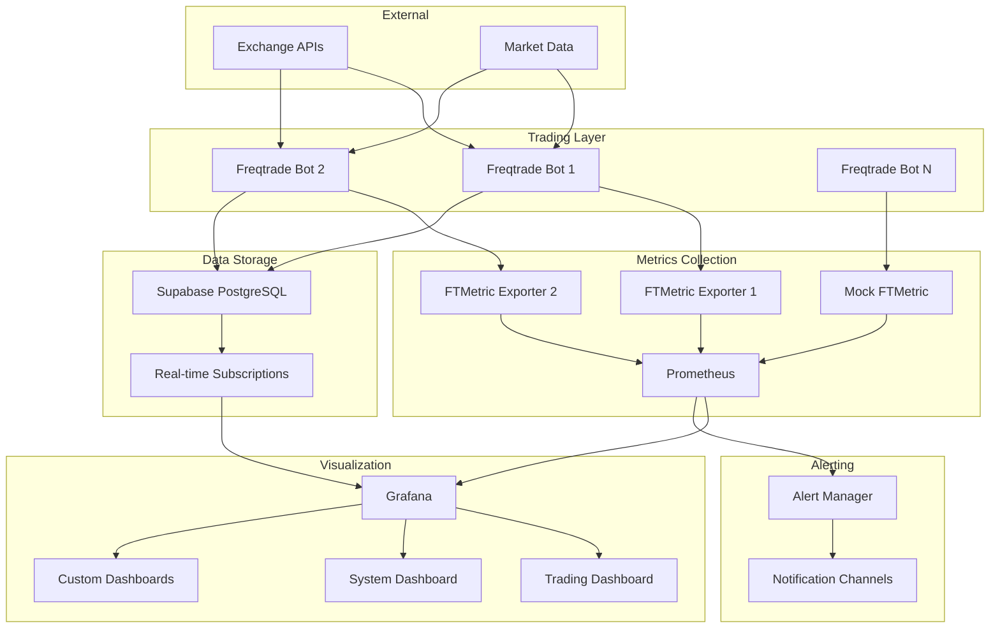

# Architecture Overview

This document provides a detailed overview of the Freqtrade Monitoring Stack architecture, component interactions, and design decisions.

## System Architecture



## Component Overview

### Trading Bots (Freqtrade)

**Purpose**: Execute cryptocurrency trading strategies

**Key Features**:
- Multiple bot instances for strategy diversification
- REST API for monitoring and control
- SQLite database for trade history
- Real-time market data processing

**Configuration**:
- Each bot has isolated configuration
- Separate databases prevent data conflicts
- API authentication for security

### Metrics Exporters (FTMetric)

**Purpose**: Transform Freqtrade data into Prometheus metrics

**Architecture**:
- One exporter per bot instance
- HTTP endpoint serving Prometheus format
- Caching layer for performance
- Health check endpoints

**Metrics Categories**:
- Trading performance (P&L, win rate, trades)
- System health (API response times, errors)
- Bot status (running, stopped, error states)
- Resource utilization (memory, CPU)

### Metrics Collection (Prometheus)

**Purpose**: Centralized metrics storage and query engine

**Features**:
- Pull-based metric collection
- Time-series database optimized for monitoring
- PromQL query language
- Alert rule evaluation
- Federation support for scaling

**Configuration**:
- Scrape intervals: 15-30 seconds
- Retention: 7 days (configurable)
- Multiple job configurations
- Service discovery ready

### Visualization (Grafana)

**Purpose**: Real-time dashboards and analytics

**Dashboard Types**:
1. **Trading Overview**: Key performance indicators
2. **System Health**: Infrastructure monitoring
3. **Custom Views**: User-defined analytics

**Features**:
- Auto-provisioning of dashboards
- Template variables for multi-bot views
- Alert visualization
- Export capabilities

### Real-time Database (Supabase)

**Purpose**: Configuration management and real-time updates

**Features**:
- PostgreSQL with real-time subscriptions
- WebSocket connections for live updates
- Row-level security
- API auto-generation

**Use Cases**:
- Bot configuration synchronization
- Real-time parameter updates
- Historical data storage
- User preferences

## Data Flow

### Metrics Pipeline

1. **Collection**: Prometheus scrapes metrics from exporters
2. **Storage**: Time-series data stored in Prometheus TSDB
3. **Query**: Grafana queries Prometheus using PromQL
4. **Display**: Real-time visualization in dashboards
5. **Alert**: Rule evaluation triggers notifications

### Configuration Updates

1. **Change**: User modifies configuration in Supabase
2. **Trigger**: Database trigger fires notification
3. **Sync**: WebSocket pushes update to connected clients
4. **Apply**: Bot receives and applies new configuration
5. **Verify**: Metrics reflect configuration changes

## Network Architecture

### Docker Networks

```yaml
networks:
  monitoring:
    driver: bridge
    # External access to dashboards
  
  trading:
    driver: bridge
    internal: true
    # Isolated bot communication
```

### Port Mapping

| Service | Internal Port | External Port | Access |
|---------|---------------|---------------|---------|
| Grafana | 3000 | 3000 | Public Dashboard |
| Prometheus | 9090 | 9090 | Admin Access |
| Freqtrade Bot 1 | 8080 | 8081 | Localhost Only |
| Freqtrade Bot 2 | 8080 | 8082 | Localhost Only |
| FTMetric 1 | 8090 | 8091 | Metrics Collection |
| FTMetric 2 | 8090 | 8092 | Metrics Collection |

### Security Boundaries

1. **Public Tier**: Grafana dashboards with authentication
2. **Admin Tier**: Prometheus with restricted access
3. **Internal Tier**: Bot APIs on localhost only
4. **Isolated Tier**: Inter-bot communication network

## Scaling Patterns

### Horizontal Scaling

**Single Node** (1-5 bots):
- Default configuration
- All services on one machine
- Suitable for development and small deployments

**Multi-Node** (5-20 bots):
- Prometheus federation
- Dedicated metrics collection nodes
- Load-balanced Grafana instances

**Enterprise** (20+ bots):
- VictoriaMetrics for better performance
- Kubernetes deployment
- Multi-region support

### Vertical Scaling

**Resource Requirements** by bot count:

| Bots | CPU Cores | RAM | Storage | Network |
|------|-----------|-----|---------|---------|
| 1-3 | 2 cores | 4GB | 20GB | 10 Mbps |
| 4-10 | 4 cores | 8GB | 50GB | 50 Mbps |
| 10-25 | 8 cores | 16GB | 100GB | 100 Mbps |
| 25+ | 16+ cores | 32GB+ | 200GB+ | 1 Gbps |

## Performance Considerations

### Metrics Collection

**Scrape Intervals**:
- Critical metrics: 15 seconds
- Standard metrics: 30 seconds
- Historical metrics: 60 seconds

**Query Optimization**:
- Use recording rules for complex calculations
- Implement query result caching
- Optimize dashboard refresh rates

### Database Performance

**Prometheus**:
- SSD storage recommended
- Regular compaction
- Appropriate retention policies

**Supabase**:
- Connection pooling
- Query optimization
- Proper indexing

## Security Architecture

### Authentication & Authorization

1. **Grafana**: Username/password with role-based access
2. **Prometheus**: Basic auth for admin functions
3. **Freqtrade**: API key authentication
4. **Supabase**: JWT-based authentication with RLS

### Network Security

1. **TLS Encryption**: All external communication
2. **Network Isolation**: Internal services on private networks
3. **Firewall Rules**: Restricted port access
4. **API Rate Limiting**: Prevent abuse

### Data Protection

1. **Secrets Management**: Environment variables and Docker secrets
2. **Key Rotation**: Regular rotation of API keys
3. **Audit Logging**: Track access and changes
4. **Backup Encryption**: Encrypted backups

## Disaster Recovery

### Backup Strategy

**Configuration Backup**:
- Git repository for infrastructure code
- Automated configuration exports
- Version-controlled dashboard definitions

**Data Backup**:
- Prometheus snapshots
- Database backups
- Bot state preservation

### Recovery Procedures

1. **Service Recovery**: Docker Compose restart procedures
2. **Data Recovery**: Backup restoration steps
3. **Configuration Recovery**: Git-based rollback
4. **Network Recovery**: DNS and routing updates

## Monitoring the Monitor

### Self-Monitoring

The stack monitors its own health:

1. **Service Health**: Docker health checks
2. **Metrics Pipeline**: Prometheus target monitoring
3. **Dashboard Availability**: Grafana health checks
4. **Data Freshness**: Staleness detection

### Alerting on Infrastructure

- Prometheus server down
- Grafana unreachable
- High resource utilization
- Failed scrape targets
- Database connectivity issues

## Future Enhancements

### Planned Features

1. **Machine Learning**: Anomaly detection for trading patterns
2. **Mobile App**: iOS/Android dashboard companion
3. **Advanced Analytics**: Portfolio optimization insights
4. **Multi-Exchange**: Support for additional exchanges
5. **Cloud Integration**: AWS/GCP/Azure deployment options

### Extensibility Points

1. **Plugin Architecture**: Custom metric collectors
2. **Webhook Integration**: External system notifications
3. **Custom Dashboards**: Domain-specific visualizations
4. **API Extensions**: Third-party integrations